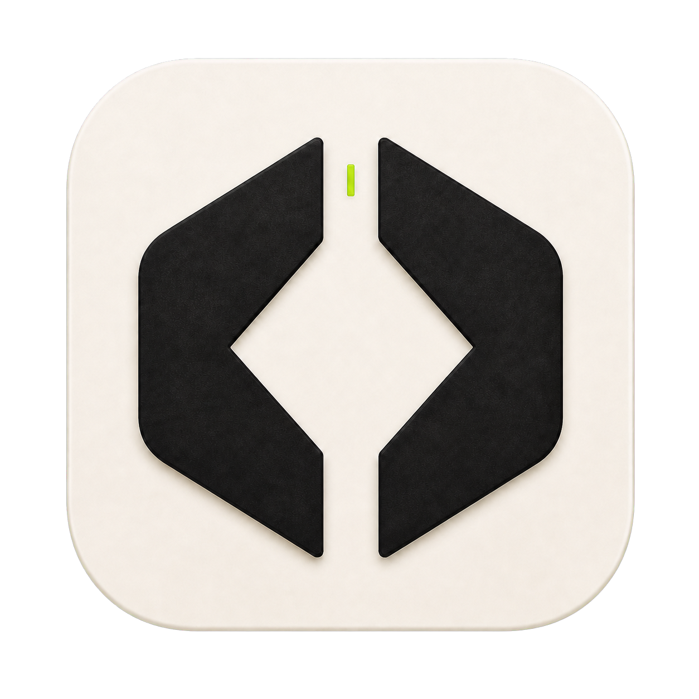
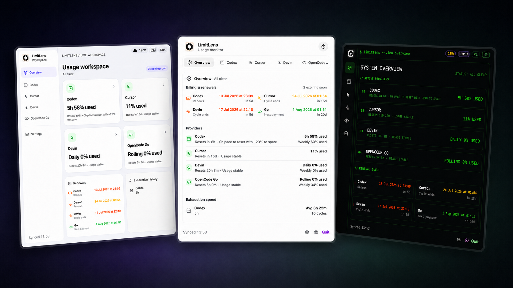

<p align="center">
  
</p>

<h1 align="center">LimitLens</h1>

<p align="center">
  <strong>AI coding usage tracker for the macOS menu bar</strong><br>
  Monitor quotas, reset windows, billing renewals, and pace for Codex, Cursor, Devin, and OpenCode Go.
</p>

<p align="center">
  <a href="https://swift.org"></a>
  <a href="https://apple.com/macos"></a>
  <a href="LICENSE"></a>
  <a href="#testing"></a>
</p>



---

## Overview

LimitLens is a native macOS menu bar app (no Dock icon) that aggregates usage from multiple AI coding assistants into one color-coded popover. It fetches on a configurable interval and shows live progress rings, countdowns, renewals, and diagnostics in the menu bar.

**Design principles**

- Runs entirely locally — no accounts, cloud sync, or telemetry
- Native Swift / SwiftUI — not Electron
- Privacy-first — provider names can be hidden in the UI and menu bar
- Zero-config start — auto-detects installed providers on first launch

---

## Supported providers

| Provider | What it tracks |
|----------|----------------|
| **Codex** (OpenAI) | Primary/secondary rate limits, reset credits, token usage, daily streaks |
| **Cursor** | Plan $ usage, Auto/API sub-limits, billing cycle, plan type |
| **Devin** (Windsurf) | Daily & weekly quotas, overage balance, plan cycle |
| **OpenCode Go** | Rolling / weekly / monthly windows, billing balance, payment history |

Each provider can be enabled or disabled independently. Disabled providers are not fetched and do not appear in the overview or menu bar.

---

## Features

### Usage & overview
- Multi-provider overview with severity coloring
- Live menu bar progress rings and countdown pills
- Billing / renewal tracking with urgency colors
- Pace projection (“will exhaust before reset” vs spare capacity)
- Exhaustion history with average time-to-exhaust
- Per-provider detail tabs, diagnostics, and on-demand refresh

### Appearance themes
Five popover layouts, switchable in **Settings → Appearance**:

| Theme | Layout |
|-------|--------|
| **Classic** | Balanced cards with top tab navigation |
| **Studio** | Spacious workspace with a labeled sidebar |
| **Terminal** | Compact dark console look with monospaced UI |
| **Pulse** | Meter-first cards with bottom navigation |
| **Harbor** | Teal instrument panel with segmented navigation |

### Menu bar display
Configurable from Settings (or the footer toggle):

- **Logos** — progress rings with provider icons
- **Countdowns** — compact time-remaining pills
- **Auto** — alternates logos and countdowns
- **Hidden** — anonymizes providers to “Provider 1–4” and uses generic glyphs

Failed fetches with cached data show a **stale** indicator.

### Notifications
Native macOS notifications (local only):

| Notification | Trigger |
|--------------|---------|
| Critical usage | Crosses threshold (default 90%, per-provider override) |
| Billing expiring | Renewal within 7 days |
| Provider unavailable | Fetch failure |
| Daily digest | Once per day at a configured hour |

Also supports quiet hours, per-provider toggles, and a test notification button. Notifications require running from the `.app` bundle (not `swift run`).

### Refresh
- Intervals: 1 / 3 / 5 / 15 / 30 min, or custom 1–60
- Retry with configurable max attempts
- Parallel provider fetches; per-provider refresh
- Clears stuck refresh state after sleep/wake

---

## Installation

### Prerequisites
- macOS 13 (Ventura) or later
- Xcode 15+ or a Swift 6.0 toolchain

### Run from source

```sh
git clone https://github.com/sebbonit/LimitLens.git
cd LimitLens
swift run LimitLens
```

Look for the LimitLens icon in the menu bar.

### Build the app bundle

```sh
Scripts/build-app.sh
open .build/LimitLens.app
```

This creates a standalone `.app` you can move to Applications. Prefer the `.app` for notifications and reliable URL opens.

---

## Configuration

On first launch, LimitLens enables only providers with detected paths. Adjust everything in the Settings tab.

**Config file**

```text
~/Library/Application Support/LimitLens/config.json
```

Corrupt configs are renamed to `config.invalid.json` and defaults are loaded.

### OpenCode Go

OpenCode Go usage is scraped from the web dashboard (the CLI token does not expose usage windows). On first launch, Settings opens with a dashboard auth form.

You need:
- Workspace ID from a URL like `https://opencode.ai/workspace/<workspace-id>/go`
- Browser cookie named `auth` for `opencode.ai`

The form writes `~/.config/opencode/opencode-quota/opencode-go.json`. For a terminal fallback:

```sh
Scripts/configure-opencode-go.sh
```

See [RUNBOOK.md](RUNBOOK.md) for more local-run details.

---

## Architecture

| Module | Type | Role |
|--------|------|------|
| `LimitLens` | Executable | SwiftUI app, menu bar, settings, notifications, config store |
| `LimitLensCore` | Library | Provider clients, models, formatting, pace & exhaustion math |

```text
UsageViewModel.start()
  ├─ Refresh loop (parallel provider fetches)
  │    ├─ Codex (app-server JSON-RPC + chatgpt.com APIs)
  │    ├─ Cursor (SQLite auth → api2.cursor.sh)
  │    ├─ Devin (protobuf / local language server / SQLite)
  │    └─ OpenCode Go (dashboard HTML scrape)
  ├─ Notification coordinator
  └─ Clock loop (1 min) → live countdowns
```

---

## Development

```sh
swift build                 # debug
swift build -c release      # release
swift build -c release --show-bin-path
swift test
swift run LimitLens
```

### Project structure

```text
LimitLens/
├── Package.swift
├── Sources/
│   ├── LimitLens/                 # App UI, view model, config, notifications
│   └── LimitLensCore/             # Provider clients and shared logic
├── Tests/
│   ├── LimitLensTests/            # App / config / menu bar / notifications
│   └── LimitLensCoreTests/        # Parsing, fixtures, pace, exhaustion
├── Resources/                     # Info.plist, icons
├── Scripts/                       # build-app.sh, configure-opencode-go.sh
├── docs/screenshots/
├── AGENTS.md
├── RUNBOOK.md
└── README.md
```

Coding guidelines for contributors and agents live in [AGENTS.md](AGENTS.md).

---

## Testing

```sh
swift test
```

187 tests across core parsing, pace projection, menu bar status, notifications, configuration, refresh, exhaustion history, diagnostics, and dashboard links.

When changing JSON/HTML parsing, add fixtures under `Tests/LimitLensCoreTests/Fixtures/`.

---

## FAQ

**Does LimitLens send data to its own servers?**  
No. It talks only to the provider APIs/dashboards you already use, with credentials already on your Mac.

**Does it store passwords or tokens?**  
It reads existing auth (e.g. `~/.codex/auth.json`, Cursor’s SQLite DB, OpenCode Go cookie config). App settings are saved under Application Support; do not commit those files.

**Why does OpenCode Go need a cookie?**  
The CLI token does not expose usage windows. Dashboard scraping needs the `auth` cookie, stored locally and sent only to opencode.ai.

**Can I hide provider names for screenshots?**  
Yes — use **Hidden** menu bar display mode in Settings.

**Notifications or “Open dashboard” do nothing under `swift run`?**  
Use the `.app` from `Scripts/build-app.sh`. Menu bar agent processes started via SwiftPM are limited for notifications and some Launch Services URL opens.

---

## Contributing

Pull requests are welcome. Keep commits focused, add tests for new behavior, and run `swift test` before opening a PR.

### Adding a provider

1. Add an async client in `Sources/LimitLensCore/` with fixtures in `Tests/LimitLensCoreTests/Fixtures/`
2. Add a `ProviderTab` case and section view in `Sources/LimitLens/`
3. Wire refresh, overview summary, menu bar, and notifications
4. Cover with tests in both test targets

---

## License

MIT
